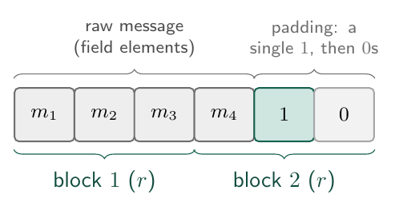
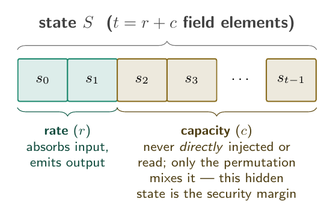
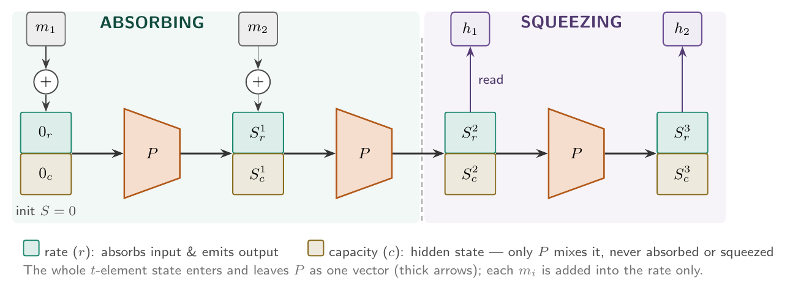
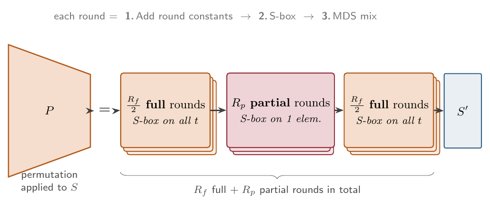
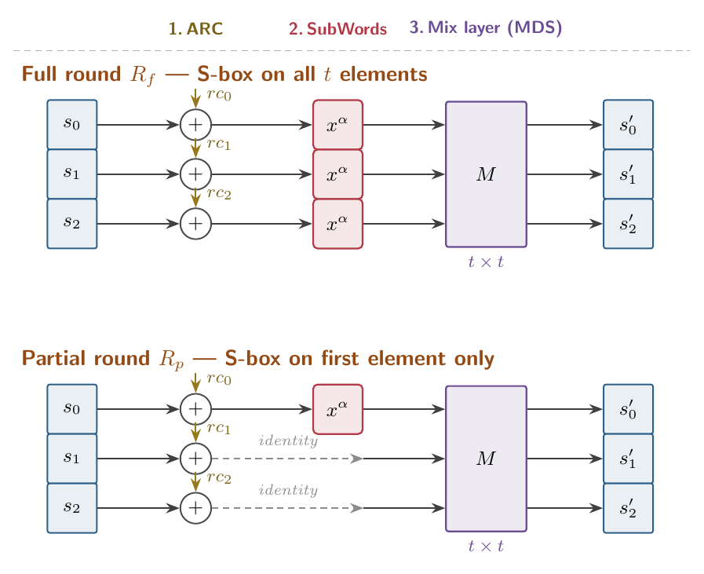
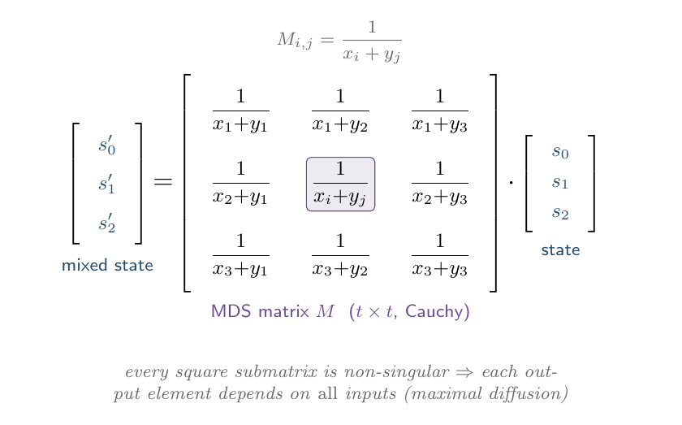

# Poseidon 1

Poseidon 1 is a cryptographic hash function designed for use in zero-knowledge proof systems. It is based on the Poseidon permutation, which is a family of permutations that are optimized for use in zero-knowledge proofs. Poseidon is optimal for ZKPs because it introduces significantly fewer constraints in the proofs. This is possible, because Poseidon doesn't operate on bits, like most hash functions, but on Galois field elements.

## Fields

Poseidon is built entirely on Galois fields (prime fields $\mathbb{F}_p$, also written as $GF(p)$).
The field size $p$ typically satisfies $p \simeq 2^n > 2^{30}$, meaning fields are at least 255 bits long.

## General Structure of the Algorithm

Poseidon uses a sponge function, unlike older hash algorithms that used compression functions. Its parameters are rate $r$, capacity $c$, and state size $t = r + c$.

The sponge function calls a special permutation function, inspired by the HADES hashing strategy, consisting of two round types - full and partial rounds.

## Algorithm

### 0. Determine Parameters

Choose the rate $r$ and capacity $c$ such that $t = r + c$ is the state size.

1. It's recommended to pick $c$ to be twice your desired security level (e.g., for 128-bit security, choose $c = 256$).
2. The rate $r$ determines the performance (speed) of the hash function. The higher the rate, the higher the hashing speed. But since the state size $t$ is fixed, increasing $r$ means decreasing $c$, which reduces security.

### 1.Input Preparation

1. Pad the raw-message string over the finite field $\mathbb{F}_p$.
   1. For a variable-length input, the padding is done by appending a single '1' followed by as many '0's as needed to make the total length a multiple of the rate $r$.
2. Split the padded message into blocks of size $r$ (the rate). We are going to feed each chunk into the sponge function.

*Padding appends a single $1$ and enough $0$s to reach a multiple of the rate $r$; the result is then cut into $r$-element chunks that are absorbed one at a time.*

### 2. Sponge Function

The internal state of the hash function consists of $t$ elements (where $t = r + c$).

The rate section absorbs the message chunks and squeezes (produces) the hashes.

The capacity section provides security against collision and pre-image attacks.

*The state is a single vector of $t = r + c$ field elements. The rate is the only part exposed to the outside — input is added into it, and output is read from it. The capacity is never **directly** injected or read; it is only ever transformed by the permutation, which keeps mixing the rate into it. That hidden, attacker-inaccessible state is what provides the security margin (collision and pre-image resistance scale with $c$).*

#### 2.1. Absorption Phase

Initialize the state to all zeros **once**, before any chunk is absorbed. Then, for every message chunk:

1. Inject the chunk into the rate part of the state — add it element-wise into the rate; the capacity is left untouched.
2. Pass the entire updated state vector through the permutation function.

(The state is *not* re-initialized per chunk — it is carried over, so each permutation mixes the new chunk together with everything absorbed so far.)

#### 2.2. Squeezing Phase

Once all message chunks have been absorbed, the squeezing phase begins:

1. Read out the first $\omicron$ elements from the rate section of the state vector S as your final hash value, where $\omicron$ is the desired output length (number of field elements in the hash output).
2. If you need more output (extra-long hash), apply the permutation function to the state vector S again and read out the next $\omega$ elements from the rate section. Repeat this process until you have produced enough output.

### 3. Permutation Function

In each call, the state vector S undergoes a series of transformations:

- execute full rounds
- execute partial rounds
- execute full rounds again

*One call to $P$ runs $\tfrac{R_f}{2}$ full rounds, then $R_p$ partial rounds, then another $\tfrac{R_f}{2}$ full rounds. Full rounds apply the S-box to all $t$ elements; partial rounds apply it to a single element — that asymmetry is what keeps Poseidon cheap to prove while staying secure.*

Regardless if a round is full or partial, the same steps are executed:

1. Add round constants (ARC) - add a unique deterministically generated pseudo-random field constant is added to every single one of the t elements inside the state vector S.
2. SubWords (SB) - apply a non-linear S-box transformation to:
    - if full-round $R_f$ - to all $t$ elements of the state vector S
    - if partial-round $R_p$ - to only the first element of the state vector S
3. Mix Layer (M) - multiply the state vector S by a special hardened MDS matrix M of size $t \times t$.

*Every round runs the same three steps — add round constants, apply the S-box, then mix with $M$. The only difference is the S-box layer: a full round sends all $t$ elements through the power map $x^{\alpha}$, while a partial round sends only the first element through it and lets the rest pass unchanged.*

### 4. MDS Matrix

The MDS matrix is generated concretely using a Cauchy matrix structure. For two sets of pairwise distinct field entries $\left\{x_i \right\}_{1 \leq i \leq t}$ and $\left\{y_j\right\}_{1 \leq j \leq t}$ where $x_i + y_j \neq 0$, the individual cells are computed as:
  
$$ M_{i,j} = \frac{1}{x_i + y_j} $$

The mix layer multiplies the state by the $t \times t$ Cauchy matrix $M$. Because every square submatrix is non-singular, each output element depends on every input element — maximal diffusion in a single linear step.

A matrix is mathematically MDS if and only if every possible submatrix within it is completely non-singular.

To prevent establishing invariant or iterative subspace trails across partial rounds without triggering any S-boxes, the following rules for the matrix are demanded:

- elements are chosen in a randomized selection process
- the candidate matrix is checked against concrete algorithm metrics to ensure no infinitely long subspace trails can be exploited
- the process repeats iteratively until and explicitly secure matrix is found.

## Pseudocode

The notation follows the sections above:

- $\mathbb{F}_p$ — the prime field; every value is a field element and all arithmetic ($+$, $\times$) is taken $\bmod\ p$.
- $S = (S_0, \dots, S_{t-1})$ — the state vector, of size $t = r + c$ (rate $r$ + capacity $c$).
- $R_f$ — the (even) total number of full rounds, split into two halves; $R_p$ — the number of partial rounds.
- $\alpha$ — the S-box exponent: the smallest $\alpha > 1$ with $\gcd(\alpha,\, p-1) = 1$ (commonly $\alpha = 5$), which makes $x \mapsto x^{\alpha}$ a bijection of $\mathbb{F}_p$.
- $RC_i \in \mathbb{F}_p^{\,t}$ — the round-constant vector of round $i$; $M$ — the $t \times t$ MDS matrix.
- $o$ — the desired output length, in field elements.

**Permutation $P(S)$** — keep a round counter $i$, starting at $i = 0$:

1. **Full rounds.** For $\ell = 1$ to $R_f / 2$, repeat:
    1. $S \gets S + RC_i$ &nbsp;*(add round constants)*
    2. $S_j \gets S_j^{\,\alpha}$ for every $j \in \{0, \dots, t-1\}$ &nbsp;*(S-box on all $t$ elements)*
    3. $S \gets M \cdot S$ &nbsp;*(MDS mixing)*
    4. $i \gets i + 1$
2. **Partial rounds.** For $\ell = 1$ to $R_p$, repeat:
    1. $S \gets S + RC_i$
    2. $S_0 \gets S_0^{\,\alpha}$ &nbsp;*(S-box on the first element only)*
    3. $S \gets M \cdot S$
    4. $i \gets i + 1$
3. **Full rounds.** For $\ell = 1$ to $R_f / 2$, repeat:
    1. $S \gets S + RC_i$
    2. $S_j \gets S_j^{\,\alpha}$ for every $j \in \{0, \dots, t-1\}$
    3. $S \gets M \cdot S$
    4. $i \gets i + 1$
4. Output $S$.

**Hash $\mathsf{Poseidon}(m, o)$** — for a message $m$ and output length $o$:

1. **Pad and split.** Append a single $1$ to $m$, then append $0$s until the length is a multiple of $r$; cut the result into blocks $B_1, \dots, B_n$, each of $r$ elements.
2. **Initialize** the state once: $S \gets (0, \dots, 0) \in \mathbb{F}_p^{\,t}$.
3. **Absorb.** For $k = 1$ to $n$, repeat:
    1. $S_j \gets S_j + (B_k)_j$ for $j = 0, \dots, r-1$ &nbsp;*(add the block into the rate)*
    2. $S \gets P(S)$
4. **Squeeze.** Read the rate into the output, $Z \gets (S_0, \dots, S_{r-1})$; then while $|Z| < o$, repeat:
    1. $S \gets P(S)$
    2. append $S_0, \dots, S_{r-1}$ to $Z$
5. Output the first $o$ elements, $(Z_0, \dots, Z_{o-1})$.

Each loop body in $P$ is exactly one round of (ARC -> S-box -> MDS).
The absorb and squeeze loops are the sponge.
